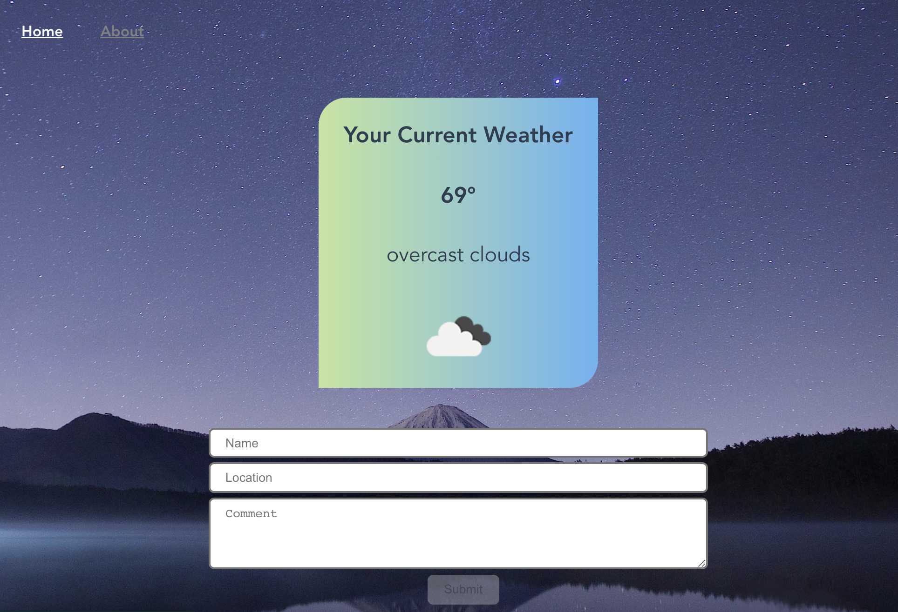

# weatherapp

## Date: 9/20/2021

#### By: Jin Yang, Ryan Craig, Brandon Hernandez

[Git](https://github.com/jinyangb/WeatherTalk) | [WeatherTalk](https://weathertalk.vercel.app/)

---

**_Description_**

A weather api app that displays users current weather conditions.

---

**_Technologies Used_**

- Python
- Flask
- Vercel

---

**_Getting Started_**

Click the site link at the top of the readme. Once you are redirected to the application enable your location and your current weather will display.

---

**_Future Updates_**

- [ ] Add full weeks weather.

---
